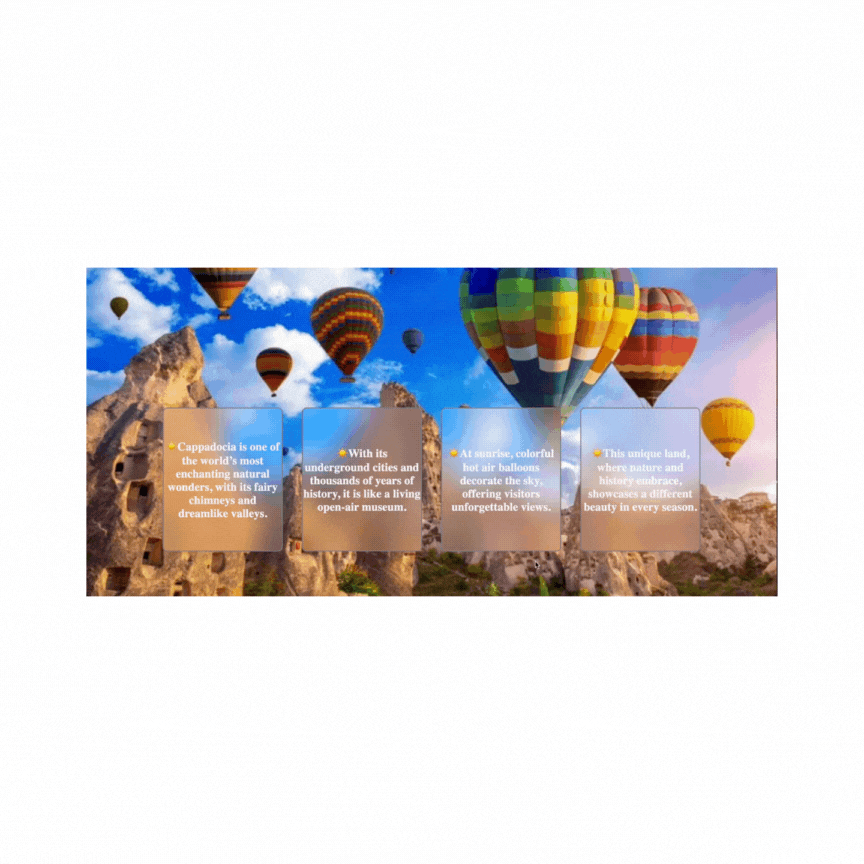

# GlassCardEffects

☀️ Cappadocia Promotion Website (HTML + CSS)
This project is a sleek and lightweight promotional page, created using only HTML and CSS, that highlights the enchanting atmosphere of Cappadocia.
With its fairy chimneys, underground cities, and colorful hot air balloons filling the sky at sunrise, Cappadocia is a unique land where nature and history embrace. 🎈⛰️🏛️

✨ Highlights
🎈 Balloon-Themed Header and Sections: Instantly immerses visitors in the spirit of Cappadocia

🌄 Hero / Banner Area: Captivating title and short introduction texts

🧭 Clean Navigation: Simple, intuitive, and fast

📱 Responsive Layout: Consistent display across mobile, tablet, and desktop (powered by CSS)

🎨 Elegant Typography & Colors: Readable, airy, and perfectly suited for tourism promotion

🛠 Technologies Used
🖼 HTML5: Meaningful and semantic content structure

🎨 CSS3: Layout, animations, and responsive design

🗺️ Short Cappadocia Introduction:
☀️ Cappadocia is one of the world’s most enchanting natural wonders, with its fairy chimneys and dreamlike valleys.

☀️ With its underground cities and thousands of years of history, it is like a living open-air museum.

☀️ At sunrise, colorful hot air balloons decorate the sky, offering visitors unforgettable views.

☀️ This unique land, where nature and history embrace, showcases a different beauty in every season.
